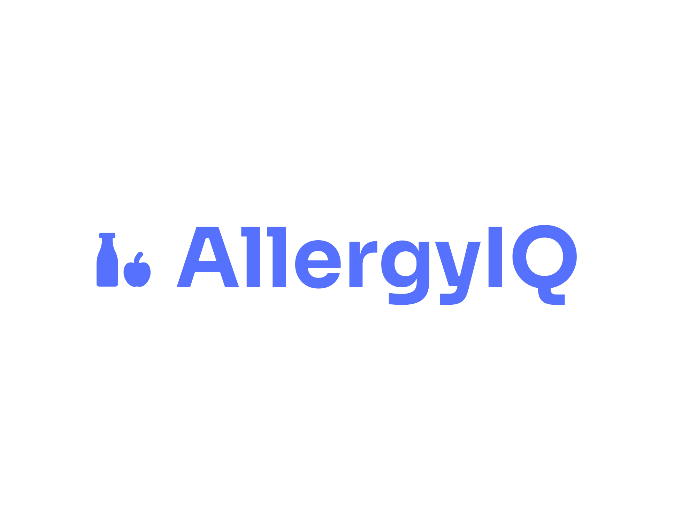

<br />
<div align="center">
  <a href="https://github.com/github_username/repo_name">
    
  </a>

<h3 align="center">AllergyIQ</h3>

  <p align="center">
    Your AI-driven dietary detection companion that scans ingredients through text, URLs, or photos to instantly identify potential allergens and dietary restrictions, ensuring safer food choices.
  </p>

  <p align="center">
    <i>Hack This Fall 2024 Submission</i>
  </p>

</div>

## About The Project

AllergyIQ bridges the gap between health requirements and cultural dietary practices, making it easier to maintain both without compromise. The application leverages advanced AI technology to provide comprehensive ingredient analysis and allergen detection through multiple input methods.

### Development Team
- Andy Huynh [ [Github](https://github.com/AH-Huynh942) | [Linkedin](https://www.linkedin.com/in/andy-huynh-5a572791/) ]
- Bernard Martis [ [Github](https://github.com/bernardm) | [Linkedin](https://www.linkedin.com/in/bernard-martis/) ]
- Dakota Heizman [ [Github](https://github.com/DakotaH5000) | [Linkedin](https://www.linkedin.com/in/Dakota-Heizman/) ]
- Silver Alcid [ [Github](https://github.com/silveralcid) | [Linkedin](https://www.linkedin.com/in/silveralcid/) ]

### Built With

* [![React][React.js]][React-url]
* [![Vite][Vite.js]][Vite-url]
* [![TypeScript][TypeScript.js]][TypeScript-url]
* [![MongoDB][MongoDB.js]][MongoDB-url]
* [![Google Cloud][GoogleCloud.js]][GoogleCloud-url]

### Problem It Solves
AllergyIQ helps users navigate complex dietary needs by simultaneously checking ingredients against both health restrictions and cultural requirements. For example, someone managing diabetes while following Halal guidelines can ensure their meals meet both criteria with a single scan.

#### Health and Cultural Integration
The app helps users navigate complex dietary needs by simultaneously checking ingredients against both health restrictions and cultural requirements. For example, someone managing diabetes while following Halal guidelines can ensure their meals meet both criteria with a single scan.

#### Comprehensive Analysis
The tool evaluates food choices across multiple dimensions:
- **Medical Requirements**: Helps prevent adverse reactions and manage health conditions
- **Cultural Preferences**: Ensures compliance with religious and cultural dietary laws
- **Nutritional Balance**: Maintains dietary quality while respecting restrictions

#### Practical Benefits
The app supports better health outcomes by making it easier to follow prescribed dietary guidelines while maintaining cultural traditions. This is particularly valuable since cultural beliefs significantly influence food choices and can impact disease risk management. Users can explore healthy alternatives within their cultural framework, leading to better adherence to both health and cultural requirements.


## Getting Started

### Prerequisites

* npm
```sh
npm install npm@latest -g
```

### Installation

1. Get API Keys for:
   - Google Gemini API
   - Google Cloud Vision API
   - MongoDB Atlas

2. Clone the repo
```sh
git clone https://github.com/your_username/AllergyIQ.git
```

3. Install NPM packages
```sh
npm install
```

4. Configure your environment variables
```js
MONGODB_URI=your_mongodb_uri
GEMINI_API_KEY=your_gemini_key
CLOUD_VISION_API_KEY=your_vision_key
```

## Core Features

### Multi-Mode Input System
- Text input for ingredient lists
- URL import for recipe scanning
- Photo capture for label detection 

### Intelligent Analysis
- Allergen identification
- Cultural dietary compliance
- Real-time risk assessment 

## Technical Architecture

### MongoDB Implementation
The database architecture consists of two primary collections:
- Ingredient Analysis Collection
- Dietary Rules Collection 

### AI Integration
The application combines:
- Google Cloud Vision API for OCR
- Google Gemini API for ingredient analysis 

## Contributing

1. Fork the Project
2. Create your Feature Branch (`git checkout -b feature/AmazingFeature`)
3. Commit your Changes (`git commit -m 'Add some AmazingFeature'`)
4. Push to the Branch (`git push origin feature/AmazingFeature`)
5. Open a Pull Request

## License

Distributed under the MIT License. See `LICENSE.txt` for more information.

## Contact

Project Link: [https://github.com/your_username/AllergyIQ](https://github.com/your_username/AllergyIQ)

[React.js]: https://img.shields.io/badge/React-20232A?style=for-the-badge&logo=react&logoColor=61DAFB
[React-url]: https://reactjs.org/
[Vite.js]: https://img.shields.io/badge/Vite-646CFF?style=for-the-badge&logo=vite&logoColor=white
[Vite-url]: https://vitejs.dev/
[TypeScript.js]: https://img.shields.io/badge/TypeScript-007ACC?style=for-the-badge&logo=typescript&logoColor=white
[TypeScript-url]: https://www.typescriptlang.org/
[MongoDB.js]: https://img.shields.io/badge/MongoDB-4EA94B?style=for-the-badge&logo=mongodb&logoColor=white
[MongoDB-url]: https://www.mongodb.com/
[GoogleCloud.js]: https://img.shields.io/badge/Google_Cloud-4285F4?style=for-the-badge&logo=google-cloud&logoColor=white
[GoogleCloud-url]: https://cloud.google.com/
